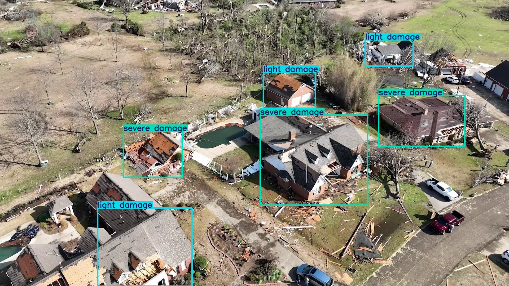
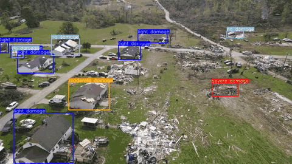

---

# 🏗️ Disaster Damage Assessment with Privacy-Preserving YOLOv5

This repository presents a **Differential Privacy (DP)**–enhanced YOLOv5 pipeline for **automated building-damage detection** from post-disaster imagery.
The system classifies buildings into four severity levels — **no damage**, **light damage**, **moderate damage**, and **severe damage** — while ensuring **privacy protection**, **lightweight inference**, and **visual interpretability** for emergency-response applications.

---

## 🚀 Key Features

* **🔐 Differentially Private Fine-tuning**
  YOLOv5s is trained with [Opacus](https://opacus.ai/) to safeguard sensitive visual data using gradient clipping + Gaussian noise.

* **⚡ Lightweight Model Compression**
  Post-training model optimization via parameter pruning for smaller, faster deployment.

* **🎥 Visual Analytics**
  Color-coded detections for images & videos with a consistent damage-severity palette.

* **🧠 Edge-ready Efficiency**
  Low-latency inference suitable for UAVs or field devices.

* **📊 Evaluation Utilities**
  Scripts for model-size comparison, sparsity analysis, and latency benchmarking.

---

## 🚁 Rapid Building Damage Assessment (DP-YOLOv5s)

Real-time aerial (UAV) damage assessment for post-disaster response.  
Model is:
- fine-tuned with differential privacy (Opacus),
- pruned for deployment on edge hardware,
- constrained to show only semantic severity labels (no raw confidences),
- and filters out low-confidence false positives (<50%).

| Example frame (still image) | Short detection clip (autoplay) |
|-----------------------------|---------------------------------|
|  | |


---

## 📁 Repository Structure

```text
disaster-damage-assessment/
├─ README.md
├─ LICENSE
├─ requirements.txt
├─ .gitignore
├─ src/
│  ├─ baseline_train.py       # Standard YOLOv5 baseline training
│  ├─ dp_train.py             # Differentially private fine-tuning using Opacus
│  ├─ detect_image.py         # Inference on images (fixed color map)
│  ├─ detect_video.py         # Inference on videos (fixed color map)
│  ├─ model_prune.py          # Model compression script
│  ├─ evaluate_model.py       # Size, sparsity & latency evaluation
│  ├─ utils_colors.py         # Centralized color mapping utility
├─ models/
│  └─ yolov5s.yaml
├─ data/
│  └─ data.yaml.example
├─ weights/
│  └─ README.md
├─ sample_media/
   ├─ demo_output.jpg
   └─ demo_video_frame.jpg

```

---

## ⚙️ Setup Instructions

### 1️⃣ Clone the Repository

```bash
git clone https://github.com/oaphyapran365/DP-YOLOv5s-Lightweight-DamageDetection.git
cd DP-YOLOv5s-Lightweight-DamageDetection
```

### 2️⃣ Install Dependencies

```bash
pip install -r requirements.txt
```

### 3️⃣ Prepare Dataset

Copy and edit `data/data.yaml.example` → `data/data.yaml`, then set dataset paths:

```yaml
train: /path/to/train/images
val: /path/to/val/images
nc: 4
names: ["no damage", "light damage", "moderate damage", "severe damage"]
```

---

## 🧠 Model Training and Fine-Tuning

### 🔹 Baseline YOLOv5 Training

```bash
python src/baseline_train.py \
  --data data/data.yaml \
  --weights yolov5s.pt \
  --epochs 50 \
  --batch 16 \
  --img 640
```

### 🔹 Differential Privacy Fine-Tuning

```bash
python src/dp_train.py \
  --data data/data.yaml \
  --base-ckpt weights/best.pt \
  --epochs 50 \
  --sigma 0.15 \
  --clip 1.5
```

---

## 🎯 Inference and Visualization

### 🖼️ Detect Damage on Images

```bash
python src/detect_image.py \
  --weights weights/dp_finetune_clean_yolov5fmt.pt \
  --source sample_media/demo_input.jpg \
  --out runs/inference/
```

### 🎬 Detect Damage in Videos

```bash
python src/detect_video.py \
  --weights weights/dp_finetune_clean_yolov5fmt.pt \
  --video sample_media/demo_video.mp4 \
  --out runs/inference/video_out.mp4
```

> **Color Legend:** 🩵 No Damage  |  🔵 Light Damage  |  🟠 Moderate Damage  |  🔴 Severe Damage

---

## 🔧 Model Optimization and Evaluation

### 🔹 Model Compression

```bash
python src/model_prune.py \
  --weights-in weights/dp_finetune_clean_yolov5fmt.pt \
  --weights-out weights/model_compressed.pt \
  --amount 0.30
```

### 🔹 Evaluate Size / Sparsity / Latency

```bash
python src/evaluate_model.py \
  --weights-orig weights/dp_finetune_clean_yolov5fmt.pt \
  --weights-pruned weights/model_compressed.pt
```

---

## 📊 Expected Outputs

| Metric              | Description                                 |
| :------------------ | :------------------------------------------ |
| **ε (epsilon)**     | Privacy budget estimate from DP fine-tuning |
| **Sparsity (%)**    | Percentage of zeroed weights after pruning  |
| **Model Size (MB)** | File size before vs after compression       |
| **Latency (ms)**    | Average inference time per frame            |

---

## 🧩 Dependencies

```text
torch >= 2.0.0
torchvision
opencv-python-headless
pandas
numpy
PyYAML
tqdm
opacus
torch_pruning
```

---

## 🔒 Ethical and Privacy Considerations

This work applies **differential privacy** to minimize risk of data leakage from sensitive post-disaster imagery.
Ensure all training data comply with relevant data-protection regulations (e.g., GDPR, FEMA, local policy).

---


## 📜 License

Licensed under the **MIT License**.
See [LICENSE](LICENSE) for details.

---

## 🙌 Acknowledgments

* [Ultralytics YOLOv5](https://github.com/ultralytics/yolov5) for the base architecture
* [Opacus](https://opacus.ai/) for DP integration
* **Kennesaw State University (KSU)** for research support

---

## 🧠 Citation

```bibtex
@misc{disasterdp2025,
  author = {Abdullahil-Oaphy, Md and collaborators},
  title  = {Privacy-Preserving Building Damage Assessment using Differentially Private YOLOv5},
  year   = {2025},
  note   = {GitHub Repository},
  url    = {https://github.com/oaphyapran365/DP-YOLOv5s-Lightweight-DamageDetection.git}
}
```

---

## 🛠️ Maintainer

**Md Abdullahil-Oaphy**
M.S. Information Technology, Kennesaw State University
📧 [your professional email here]
🔗 [LinkedIn](https://linkedin.com/in/your-profile)  •  [GitHub](https://github.com/your-username)

---


