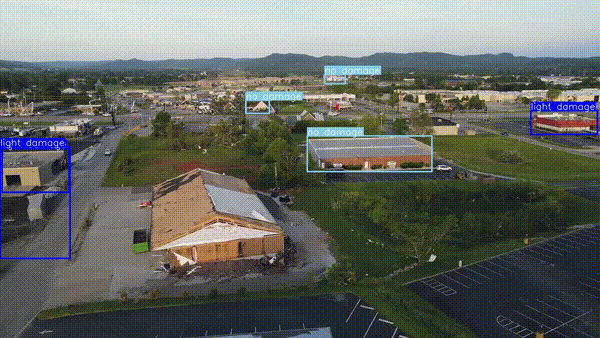

---

# Disaster Damage Assessment with Privacy-Preserving YOLOv5

This repository contains the open-source implementation associated with our peer-reviewed conference paper:

***“Lightweight and Privacy-Enhanced Detection Model on Aerial Imagery for Post-Disaster Building Damage Reconnaissance,” published in the Proceedings of the 59th Hawaii International Conference on System Sciences (HICSS) in 2026.***

The project presents a **Differential Privacy (DP)**–enhanced YOLOv5 pipeline for **automated post-disaster building-damage assessment** from aerial imagery.

The system classifies detected buildings into four damage-severity levels — **no damage**, **light damage**, **moderate damage**, and **severe damage** — while combining **privacy-preserving model training**, **lightweight inference**, and **visual interpretability** for disaster-response and emergency-reconnaissance applications.

The framework is designed for deployment scenarios involving **UAV imagery**, **field devices**, and other **resource-constrained environments** where rapid, secure, and reliable damage assessment is important.

---


## 🚀 Key Features

* **🔐 Differentially Private Fine-tuning**
  YOLOv5s is trained with [Opacus](https://opacus.ai/) for differential privacy, combining gradient clipping and calibrated noise injection to protect sensitive visual data.

* **⚡ Lightweight Model Compression**
  Post-training model optimization via parameter pruning for smaller, faster deployment.

* **🎥 Visual Analytics**
  Color-coded detections for images & videos with a consistent damage-severity palette.

* **🧠 Edge-ready Efficiency**
  Low-latency inference suitable for UAVs or field devices.

* **📊 Evaluation Utilities**
  Scripts for model-size comparison, sparsity analysis, and latency benchmarking.

---

## 🚁 Rapid Building Damage Assessment (DP-YOLOv5s)

Real-time aerial (UAV) damage assessment for post-disaster response.  
Model is:
- fine-tuned with differential privacy (Opacus),
- pruned for deployment on edge hardware,
- constrained to show only semantic severity labels (no raw confidences),
- and filters out low-confidence false positives (<50%).

| Short detection clip - 1(autoplay) | Short detection clip -2 (autoplay) |
|-----------------------------|---------------------------------|
|  | |


---

## 📁 Repository Structure

```text
disaster-damage-assessment/
├─ README.md
├─ requirements.txt
├─ .gitignore
├─ src/
│  ├─ baseline_train.py       # Standard YOLOv5 baseline training
│  ├─ dp_train.py             # Differentially private fine-tuning using Opacus
│  ├─ detect_image.py         # Inference on images (fixed color map)
│  ├─ detect_video.py         # Inference on videos (fixed color map)
│  ├─ model_prune.py          # Model compression script
│  ├─ evaluate_model.py       # Size, sparsity & latency evaluation
│  ├─ utils_colors.py         # Centralized color mapping utility
├─ models/
│  └─ yolov5s.yaml
├─ data/
│  └─ data.yaml
├─ sample_media/
   ├─ demo_output.gif
   ├─ demo_output.jpg
   └─ demo_video_frame.mp4

```

---

## ⚙️ Setup Instructions

### 1️⃣ Clone the Repository

```bash
git clone https://github.com/oaphyapran365/DP-YOLOv5s-Lightweight-DamageDetection.git
cd DP-YOLOv5s-Lightweight-DamageDetection
```

### 2️⃣ Install Dependencies

```bash
pip install -r requirements.txt
```

### 3️⃣ Prepare Dataset

Copy and edit `data/data.yaml`, with proper dataset paths:

```yaml
train: /path/to/train/images
val: /path/to/val/images
nc: 4
names: ["no damage", "light damage", "moderate damage", "severe damage"]
```

---

## 🧠 Model Training and Fine-Tuning

### 🔹 Baseline YOLOv5 Training

```bash
python src/baseline_train.py \
  --data data/data.yaml \
  --weights yolov5s.pt \
  --epochs 50 \
  --batch 16 \
  --img 640
```

### 🔹 Differential Privacy Fine-Tuning

```bash
python src/dp_train.py \
  --data data/data.yaml \
  --base-ckpt weights/best.pt \
  --epochs 50 \
  --sigma 0.15 \
  --clip 1.5
```

---

## 🔧 Model Optimization and Evaluation

### 🔹 Model Compression

```bash
python src/model_prune.py \
  --weights-in weights/dp_finetune_clean_yolov5fmt.pt \
  --weights-out weights/model_compressed.pt \
  --amount 0.30
```

### 🔹 Evaluate Size / Sparsity / Latency

```bash
python src/evaluate_model.py \
  --weights-orig weights/dp_finetune_clean_yolov5fmt.pt \
  --weights-pruned weights/model_compressed.pt
```

---

## 🎯 Inference and Visualization

### 🖼️ Detect Damage on Images

```bash
python src/detect_image.py \
  --weights weights/model_weights_yolov5fmt.pt \
  --source sample_media/demo_input.jpg \
  --out runs/inference/
```

### 🎬 Detect Damage in Videos

```bash
python src/detect_video.py \
  --weights weights/model_weights_yolov5fmt.pt \
  --video sample_media/demo_video.mp4 \
  --out runs/inference/video_out.mp4
```

> **Color Legend:** 🩵 No Damage  |  🔵 Light Damage  |  🟠 Moderate Damage  |  🔴 Severe Damage

---

## 🧩 Dependencies

```text
torch >= 2.0.0
torchvision
opencv-python-headless
pandas
numpy
PyYAML
tqdm
opacus
torch_pruning
```

---

## 🔒 Ethical and Privacy Considerations

This work applies **differential privacy** to minimize risk of data leakage from sensitive post-disaster imagery.
Ensure all training data comply with relevant data-protection regulations (e.g., GDPR, FEMA, local policy).

---


## 📜 License (AGPL-3.0-or-later)

This project is licensed under the **GNU Affero General Public License v3.0 or later (AGPL-3.0-or-later)**.  
You may redistribute and/or modify this software under the terms of the AGPL as published by the Free Software Foundation.

See the full license text in the [`LICENSE`](LICENSE) file.

### 🔔 AGPL Notice
Under the AGPL license, **if you modify this software and deploy it over a network (e.g., as a web service or API)**,  
you **must publicly release the complete source code of your modified version**, including all changes,  
as required by the AGPL-3.0.

For more details, visit: https://www.gnu.org/licenses/agpl-3.0.html


---

## 🙌 Acknowledgments

* [Ultralytics YOLOv5](https://github.com/ultralytics/yolov5) for the base architecture
* [Opacus](https://opacus.ai/) for DP integration
* **IntelliTrust-Lab**
* **Kennesaw State University (KSU)** for research support


```

## 🧠 Citation

This repository provides the open-source implementation associated with the following peer-reviewed publication:

**Oaphy, Md Abdullahil, Da Hu, Adeel Khalid, and Honghui Xu. 2026. “Lightweight and Privacy-Enhanced Detection Model on Aerial Imagery for Post-Disaster Building Damage Reconnaissance.” In *Proceedings of the 59th Hawaii International Conference on System Sciences*, 7058–7067. University of Hawaii at Manoa. https://doi.org/10.24251/HICSS.2026.837**

If you use the code, methodology, or results from this repository in academic work, please cite the published conference paper:

```bibtex
@inproceedings{oaphy2026lightweight,
  author    = {Md Abdullahil Oaphy and Da Hu and Adeel Khalid and Honghui Xu},
  title     = {Lightweight and Privacy-Enhanced Detection Model on Aerial Imagery for Post-Disaster Building Damage Reconnaissance},
  booktitle = {Proceedings of the 59th Hawaii International Conference on System Sciences},
  pages     = {7058--7067},
  year      = {2026},
  publisher = {University of Hawaii at Manoa},
  doi       = {10.24251/HICSS.2026.837},
  url       = {https://hdl.handle.net/10125/112242}
}

```

---


